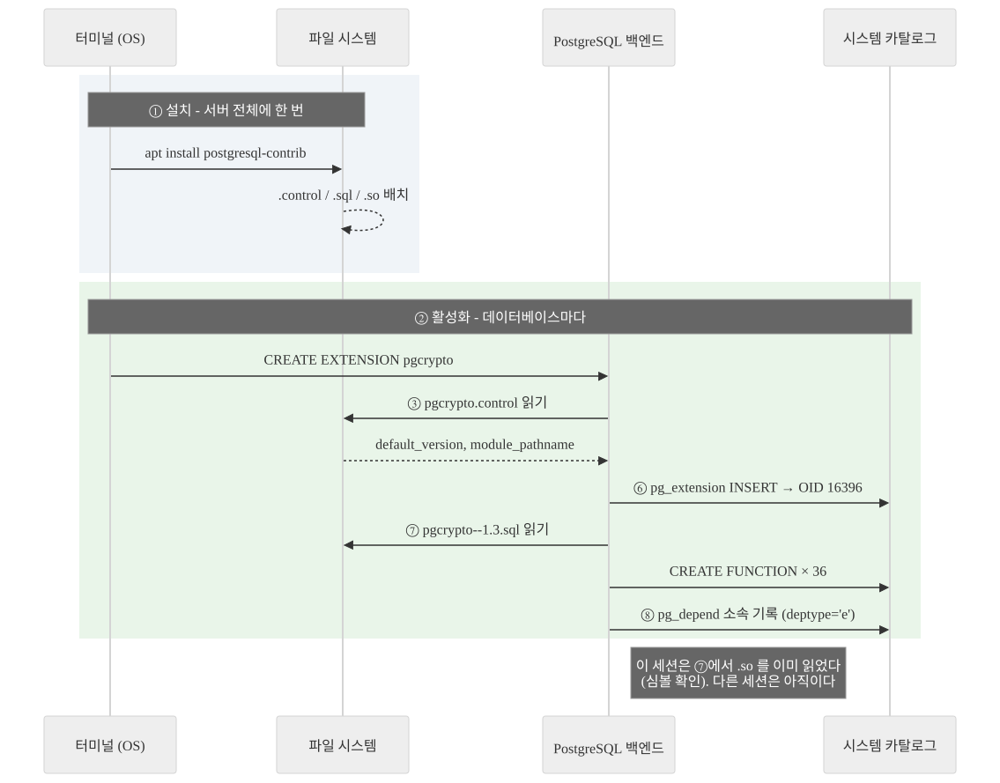
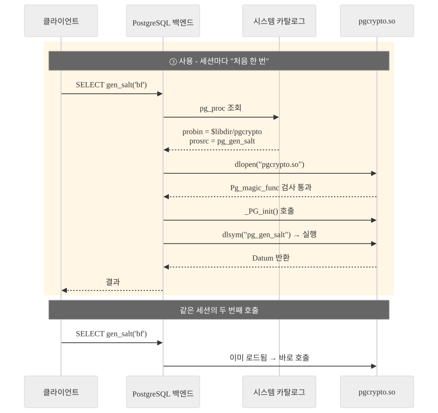
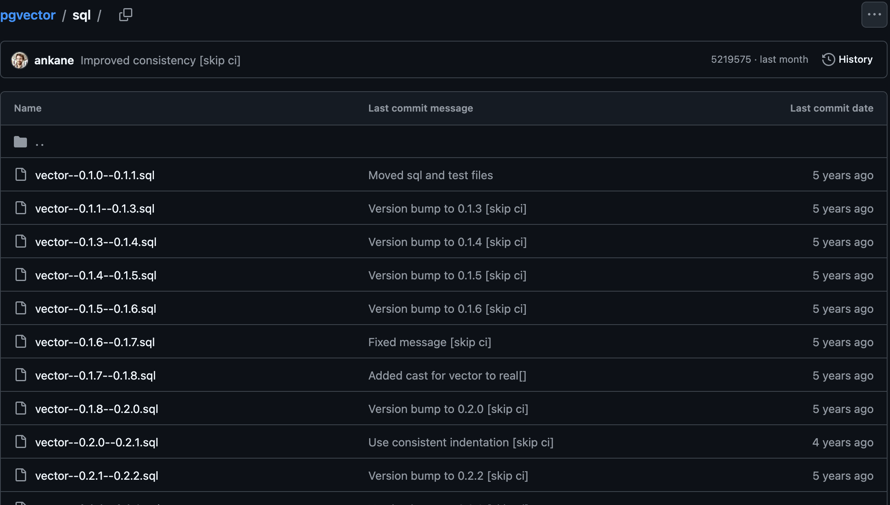
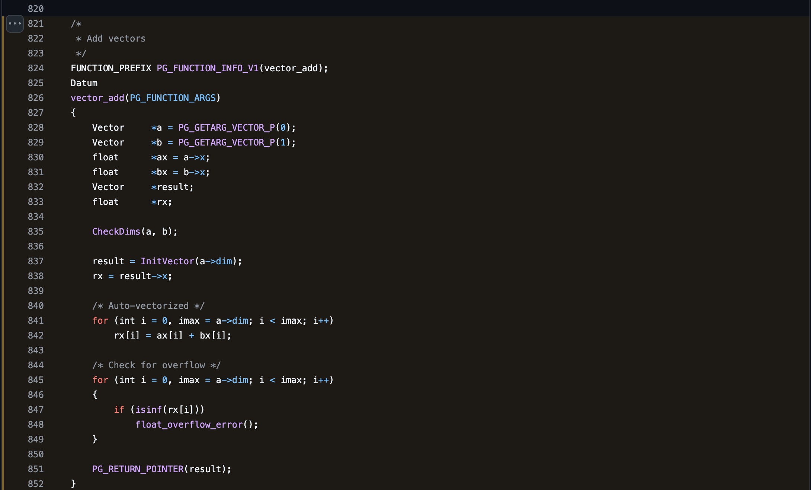

<!-- _class: lead -->

# 🐘 PostgreSQL Extension

## `CREATE EXTENSION` 은 도대체 무슨 일을 하는가

<br>

**PG Extension Study - Week 1 킥오프**

<span class="small">발표 후 `labs/` 에서 전부 직접 돌려볼 수 있습니다</span>

---

<!-- _class: lead -->

# 0. 자기소개 · 아이스브레이킹

## 시작하기 전에 서로 알아가기

<div class="agenda">

- **이름 / 하는 일 / MBTI 등등... 아무거나 좋아요**
- **PostgreSQL 을 어디서 쓰고 계신가요?** 업무 · 사이드 프로젝트 · 아직 안 씀
- *(있다면)* **최근에 "이거 DB 가 해줬으면" 했던 순간**

</div>

<div class="toc">
<b>0 소개</b> · 1 무엇인가 · 2 왜 필요한가 · 3 내부 동작 · 4 파일 구성 · 5 만들기 ①SQL · 6 만들기 ②C · 부록 A 프로세스와 메모리 · 부록 B 부류 나누기 · 부록 C 부류별 사례 · 부록 D 각자 파헤치기
</div>

---

## 오늘 다룰 것

1. **Extension 이란 무엇인가** - 한 줄 정의에서 시작해 한 겹씩 넓히기
2. **그런데 왜 필요할까** - 없던 시절엔 무엇이 문제였나
3. **`CREATE EXTENSION` 내부 동작** - 3단계 · 8스텝으로 추적
4. **Extension 을 이루는 파일들** - `.control` 이 왜 필요한가
5. **직접 만들어보기 ①** - SQL 만으로
6. **직접 만들어보기 ②** - C 로

<br>

여기까지가 본편입니다. **직접 돌리는 실습은 lab00 ~ lab03.**

<span class="small">**부록** - A 프로세스와 메모리 · B 부류 나누는 법 · C 부류별 사례(lab04~lab13) · D 각자 파헤치는 절차. 필요한 것만 골라 보면 됩니다.</span>

---

## 이 자료의 표기 약속

명령을 **어디서 치는지**가 중요합니다. 프롬프트 기호로 구분합니다.

```bash
$ psql -U postgres -d study        # ← $ 는 터미널(셸)에서 치는 명령
study=# CREATE EXTENSION hello;    # ← study=# 는 psql 안에서 치는 SQL
study=# \dx                        # ← 백슬래시로 시작하면 psql 메타커맨드
```

| 기호 | 어디 | 예 |
|---|---|---|
| `$` | 터미널 | `make install`, `docker compose up`, `pg_config --sharedir` |
| `study=#` | psql 안 (SQL) | `CREATE EXTENSION`, `SELECT`, `ALTER EXTENSION` |
| `study=# \` | psql 메타커맨드 | `\dx` 설치 목록 · `\dx+` 소속 객체 · `\d` 테이블 구조 · `\!` 셸 실행 |

<span class="small">메타커맨드는 SQL 이 아니라 psql 프로그램의 기능입니다. 다른 클라이언트에서는 안 됩니다.</span>

---

<!-- _class: lead -->

# 1. Extension 이란 무엇인가

## 한 줄에서 시작해 한 겹씩 넓히기

<div class="agenda">

- 한 줄 정의 - **"PostgreSQL을 고치지 않고 기능을 더하는 설치 단위"**
- 가장 짧은 실물 - `CREATE EXTENSION` 한 줄이 만드는 것
- 무엇을 더할 수 있나 - 타입 · 함수 · 인덱스 · 언어까지
- "설치되어 있다"의 두 가지 뜻

</div>

<div class="toc">
0 소개 · <b>1 무엇인가</b> · 2 왜 필요한가 · 3 내부 동작 · 4 파일 구성 · 5 만들기 ①SQL · 6 만들기 ②C · 부록 A 프로세스와 메모리 · 부록 B 부류 나누기 · 부록 C 부류별 사례 · 부록 D 각자 파헤치기
</div>

---

## 한 줄로 말하면

<br>

# **PostgreSQL을 고치지 않고 기능을 더하는 "설치 단위"**

<br>

| 이 말의 세 조각 | 뜻 |
|---|---|
| **기능을 더한다** | 없던 함수 · 타입 · 연산자가 생긴다 |
| PostgreSQL 을 **고치지 않고** | 소스를 건드리거나 다시 컴파일하지 않는다 |
| **설치 단위** | 낱개가 아니라 **이름 하나로 묶어서** 깔고 지운다 |

<br>

> 지금부터 이 한 줄을 한 겹씩 벗겨봅니다. 먼저 **가장 짧은 실물**부터 보겠습니다.

---

## 한 줄이 실제로 하는 일

```
study=# CREATE EXTENSION pgcrypto;
study=# SELECT crypt('my_password', gen_salt('bf', 8));

 $2a$08$/hQi8XVWLCQ6AOQ0PvXOLOe/3AIaUu2CLkSWb12rwGeImrbqRyHsW
```

이 한 줄로 **함수 36개**가 생기고, 각각에 "pgcrypto 소속"이라는 꼬리표가 붙습니다.

```
study=# SELECT count(*) FROM pg_depend d
        JOIN pg_extension e ON e.oid = d.refobjid
        WHERE d.deptype = 'e' AND e.extname = 'pgcrypto';

 36
```

**"함수가 생겼다"보다 이 꼬리표가 중요합니다.** 왜 중요한지는 2장에서, 어떻게 붙는지는 3장에서 봅니다.

---

## Extension 이 추가할 수 있는 것

| 종류 | 예시 |
|---|---|
| 🔢 **데이터 타입** | `vector`(pgvector), `geometry`(PostGIS), `hstore`, `citext` |
| ⚡ **함수 & 연산자** | 대부분의 extension. `<->` (거리), `ST_*` (공간) |
| 🗂️ **인덱스 액세스 메서드** | IVFFlat, HNSW(pgvector), Bloom, RUM |
| 🌐 **FDW** | postgres_fdw, file_fdw, mongo_fdw |
| 💻 **절차적 언어** | PL/Python, PL/v8(JavaScript), PL/R |
| ⚙️ **Background Worker** | pg_cron 스케줄러, TimescaleDB 백그라운드 잡 |
| 🪝 **Hook** | pg_stat_statements (실행기에 끼어들기) |

> 종류가 이렇게 넓은 이유는 **PostgreSQL 이 이 지점들을 일부러 열어뒀기** 때문입니다.
> 무엇을 어떻게 열어뒀는지는 **부록 B** 에서 부류별로 봅니다.

---

## 먼저 헷갈리는 것 하나

**"pgvector 를 설치했다"는 말은 두 가지 중 하나입니다.**

<br>

### ① 서버에 파일을 놓았다
`apt install postgresql-16-pgvector` 또는 `make install` → **서버 전체**에 대해 한 번. OS 작업입니다.

### ② 데이터베이스에서 활성화했다
`CREATE EXTENSION vector;` → **DB 하나**에 대해. SQL 작업입니다.

<br>

> **①을 안 하면 ②가 실패합니다. ①만 하면 아무 일도 일어나지 않습니다.** 이 둘을 구분하지 않으면 `could not open extension control file` 에러를 이해할 수 없습니다.

---

## 그림으로



<span class="small">같은 서버라도 **DB 마다 활성화 여부가 다릅니다.** extension 은 DB 단위입니다.</span>

---

## 확인하는 법

```
study=# SELECT name, default_version, installed_version
        FROM pg_available_extensions WHERE name IN ('hstore','vector');

  name   | default_version | installed_version
---------+-----------------+-------------------
 hstore  | 1.8             | 1.8                 ← ①②  둘 다 됨
 vector  | 0.8.0           |                     ← ① 만 됨 (미활성)
```

- **목록에 아예 없다** → ① 이 안 됨. 패키지를 설치하거나 이미지를 바꿔야 합니다
- **`installed_version` 이 비어 있다** → `CREATE EXTENSION` 만 하면 됩니다

<span class="small">짧게 보려면 `\dx` - **📦 lab01**</span>

---

<!-- _class: lead -->

# 2. 그런데 왜 필요할까

## 없던 시절을 보면 답이 나옵니다

<div class="agenda">

- ❓ `CREATE EXTENSION` 없이 그냥 만들면 안 되나
- 9.1 이전엔 어떻게 설치했나 - **📦 lab01 로 재현**
- 소속을 기록하지 않아 생기는 **세 가지 문제** - 삭제 · 백업 · 업그레이드
- 9.1 이 한 일은 사실상 **"소속을 기록하자"** 하나

</div>

<div class="toc">
0 소개 · 1 무엇인가 · <b>2 왜 필요한가</b> · 3 내부 동작 · 4 파일 구성 · 5 만들기 ①SQL · 6 만들기 ②C · 부록 A 프로세스와 메모리 · 부록 B 부류 나누기 · 부록 C 부류별 사례 · 부록 D 각자 파헤치기
</div>

---

## 같은 결과인데, 왜 전용 명령이 있을까

여기까지 보면 이런 의문이 남습니다.

```sql
-- ① 전용 명령으로 깔거나
CREATE EXTENSION pgcrypto;

-- ② 같은 내용을 손으로 쓰거나  (함수 36개니까 36번)
CREATE FUNCTION gen_salt(text) RETURNS text
AS '$libdir/pgcrypto', 'pg_gen_salt'
LANGUAGE C VOLATILE STRICT;
```

**②도 됩니다.** `.so` 안의 C 함수를 `CREATE FUNCTION` 으로 가리키는 문법은 PostgreSQL 초기부터 있었고 지금도 그대로 동작합니다. 손이 더 갈 뿐, 만들어지는 함수는 같습니다.

그렇다면 `CREATE EXTENSION` 이라는 전용 명령도, `.control` 파일도, `--1.3.sql` 이라는 파일명 규칙도 **왜 있어야 할까요?**

> 답은 **"없던 시절"** 에 있습니다. 9.1(2011) 이전에는 실제로 ②밖에 없었고, 그때 무엇이 불편했는지를 보면 지금의 시스템이 왜 이렇게 생겼는지가 그대로 드러납니다.

---

## Extension 이전 (~ PostgreSQL 9.0)

**당시 contrib 설치법은 이랬습니다.**

```bash
$ psql -d mydb -f /usr/share/postgresql/8.4/contrib/hstore.sql
```

**그냥 SQL 스크립트를 실행하는 것**이 전부였습니다. `CREATE EXTENSION` 은 없었습니다.

```sql
-- contrib/hstore.sql 의 내용 (실제로 지금 hstore--1.4.sql 과 거의 같습니다)
CREATE TYPE hstore;

CREATE FUNCTION hstore_in(cstring) RETURNS hstore
AS '$libdir/hstore'                    -- ← 경로를 직접 적었다
LANGUAGE C STRICT IMMUTABLE;
-- ... 이런 게 500줄
```

> **📦 lab01 / `00-the-old-way.sql`** 에서 이 방식을 **그대로 재현**합니다. 지금의 설치 스크립트에서 안전장치 두 줄만 걷어내면 옛날 `hstore.sql` 이 됩니다.

---

## 잘 됩니다. 그런데…

```console
study=# SELECT 'a=>1, b=>2'::hstore -> 'a';
 1                                          ← 동작한다

study=# \dx
  Name   | Version |   Schema   |         Description
---------+---------+------------+------------------------------
 plpgsql | 1.0     | pg_catalog | PL/pgSQL procedural language
                                            ← hstore 가 없다!
```

```console
 hstore 가 만든 함수 수 |  소속이 기록된 객체 수
------------------------+------------------------
                     57 |                      0
```

**함수 57개와 타입 2개가 생겼는데, "누구 소속"인지 아무 데도 적혀 있지 않습니다.** 내가 만든 함수와 구분할 방법이 없습니다. 여기서 세 가지 문제가 따라 나옵니다.

<div class="small">

1. **지울 수가 없다** - 57개 이름을 다 알아야 하고, `CASCADE` 는 내 테이블까지 지운다
2. **백업에 박제된다** - `pg_dump` 결과에 함수 정의 57개가 그대로 들어간다
3. **버전을 올릴 수 없다** - 몇 버전이 깔렸는지조차 DB 가 모른다

</div>

---

## 문제 ① - 지울 수가 없다

```console
study=# DROP TYPE hstore;
ERROR:  cannot drop type hstore because other objects depend on it
DETAIL:  function hstore_in(cstring) depends on type hstore
         function hstore_out(hstore) depends on type hstore
         ... (78개)
```

**57개 객체의 이름을 전부 알아야** 순서대로 지울 수 있었습니다. 그래서 옛날 contrib 에는 **`uninstall_hstore.sql`** 이라는 파일이 따로 들어 있었습니다.

`DROP TYPE hstore CASCADE` 는 어떨까요? lab01 에서 직접 해보면:

```console
NOTICE:  drop cascades to 78 other objects
 CASCADE 후에도 따로 지운 함수 수
----------------------------------
                                4     ← 인자가 internal 이라 안 딸려갔다
```

> CASCADE 는 **hstore 컬럼을 쓰는 내 테이블까지** 지웁니다. 안전한 방법이 아니었습니다.

---

## 문제 ② - 백업에 함수 정의가 통째로 박제된다

```console
$ pg_dump mydb | grep -c "^CREATE FUNCTION"
57

$ pg_dump mydb | grep -A2 "CREATE FUNCTION public.hstore_in"
CREATE FUNCTION public.hstore_in(cstring) RETURNS public.hstore
    LANGUAGE c IMMUTABLE STRICT PARALLEL SAFE
    AS '$libdir/hstore', 'hstore_in';        ← 경로가 백업에 굳어버린다
```

**백업 파일이 특정 버전의 C 함수 시그니처에 묶입니다.**

복원 대상 서버의 hstore 가 다른 버전이라면(함수가 추가·변경·삭제됐다면) 복원이 깨지거나, **옛 정의가 되살아나 새 `.so` 와 어긋납니다.**

> 이것이 **`pg_upgrade` 가 어려웠던 핵심 이유**입니다. 지금은 `CREATE EXTENSION hstore;` 한 줄만 덤프되고, 정의는 새 서버의 파일이 제공합니다.

---

## 문제 ③ - 버전을 올릴 방법이 없다

새 버전 hstore 가 나왔습니다. 어떻게 올릴까요?

| 시도 | 결과 |
|---|---|
| 새 `hstore.sql` 을 그냥 다시 실행 | `ERROR: type "hstore" already exists` |
| `uninstall_hstore.sql` → 새 `hstore.sql` | **hstore 컬럼을 쓰는 테이블이 있으면 불가능** |
| 바뀐 함수만 골라 `CREATE OR REPLACE` | 뭐가 바뀌었는지 **직접 diff 를 떠야 함** |

<br>

**"현재 몇 버전이 깔려 있는지"조차 DB 에 기록되지 않았습니다.** 버전을 알려면 함수 목록을 보고 추측해야 했습니다.

> 지금은 `ALTER EXTENSION hstore UPDATE;` 한 줄이고, PostgreSQL 이 `1.4 → 1.5 → 1.6 → 1.7 → 1.8` 경로를 알아서 찾아 실행합니다.

---

## ❓ 그럼 옛날엔 C 코드를 못 돌렸나요?

**아닙니다. C 함수 실행은 Extension 시스템보다 훨씬 오래됐습니다.**

방금 재현한 그 `hstore.sql` 이 하고 있던 일이 정확히 그것입니다.

```sql
CREATE FUNCTION hstore_in(cstring) RETURNS hstore
AS '$libdir/hstore', 'hstore_in'     -- ← .so 파일 + C 심볼 이름
LANGUAGE C STRICT IMMUTABLE;
```

이 문법은 **PostgreSQL 초기부터 있었습니다.** 동적 로딩(`dlopen`), 함수 관리자(fmgr), `PG_MODULE_MAGIC` - C extension 을 굴리는 장치는 9.1 이전에 이미 다 있었습니다.

> **9.1 이 추가한 것은 "C 실행 능력"이 아니라 "포장(packaging)"입니다.**
> 흩어진 객체들을 하나의 이름으로 묶고, 버전을 붙이고, 소속을 기록한 것뿐입니다.
> 그래서 `CREATE EXTENSION` 없이도 C 함수는 여전히 잘 돕니다 - **📦 lab01 / `00-the-old-way.sql`**

---

## 그 외의 방법들도 마찬가지였습니다

| 방법 | 문제 |
|---|---|
| **소스 패치 후 재컴파일** | 버전 올릴 때마다 패치 재적용. 사실상 PostgreSQL 을 포크하는 것 |
| **`LOAD 'mylib.so'`** | 세션마다 `LOAD` 를 해야 하고, 카탈로그에 아무 기록도 안 남음 |
| **`CREATE FUNCTION` 직접 등록** | 위에서 본 그대로. 소속 추적 불가 |

<br>

> **셋 다 같은 문제로 수렴합니다.** "이 함수/타입/연산자가 **어느 패키지 소속인가**?" 를 DB 가 모릅니다.
> 소속을 모르면 → **지울 수 없고 · 올릴 수 없고 · 백업할 수 없습니다.**
> 9.1 에서 한 일은 사실상 **"소속을 기록하자"** 하나입니다.

---

## PostgreSQL 9.1 (2011) - Extension 시스템

| | Extension 이전 | Extension 이후 |
|---|---|---|
| 버전 관리 | ❌ | control 파일 + 업그레이드 스크립트 |
| 의존성 추적 | ❌ | `pg_depend` `deptype='e'` |
| 카탈로그 기록 | ❌ | `pg_extension` 테이블 |
| 원자적 설치/삭제 | ❌ | `CREATE`/`DROP EXTENSION` (트랜잭션!) |
| `pg_dump` 지원 | 함수 정의 57개 | `CREATE EXTENSION` 한 줄 |
| 권한 모델 | superuser 만 | control 파일의 `superuser` 선언<br><span class="small">일반 유저에게 여는 `trusted` 는 나중에 PG 13 에서 추가</span> |

<br>

**여기서부터 extension 을 "배포"할 수 있게 됐습니다.** 버전을 붙이고, 의존성을 걸고, 통째로 지울 수 있으니까요. 지금 쓰는 pgvector · PostGIS 도 전부 이 틀 위에 얹혀 있습니다.

---

## 이미 옛날 방식으로 깔아둔 사람들은?

9.1 로 올린 사람들에게는 **이미 hstore 함수 57개가 흩어져 있었습니다.** `CREATE EXTENSION hstore` 는 충돌로 실패합니다.

```console
study=# CREATE EXTENSION hstore;
ERROR:  type "hstore" already exists
```

그래서 9.1 은 **전용 마이그레이션 경로**를 함께 넣었습니다.

```sql
CREATE EXTENSION hstore FROM unpackaged;
```

이건 `hstore--unpackaged--1.0.sql` 이라는 특수 스크립트를 실행하는데, 안에는 이런 게 57줄 들어 있었습니다:

```sql
ALTER EXTENSION hstore ADD TYPE hstore;
ALTER EXTENSION hstore ADD FUNCTION hstore_in(cstring);
-- ... 흩어져 있던 객체를 하나씩 extension 소속으로 편입
```

<span class="small">이 `unpackaged` 스크립트들은 역할을 다해 **PostgreSQL 13 에서 제거**되었습니다.</span>

---

<!-- _class: lead -->

# 3. `CREATE EXTENSION` 내부 동작

## 3단계 · 8스텝으로 추적하기

<div class="agenda">

- 전체 그림 - **준비 · 검증 · 실행** 3단계
- 【2단계】 검증 - **에러는 대부분 여기서 난다**
- 【3단계】 실행 - 카탈로그 · 스크립트 · 꼬리표
- 설치가 끝나도 **`.so` 는 아직 안 읽는다**
- 생애주기 시퀀스 - 설치 · 활성화 · 사용

</div>

<div class="toc">
0 소개 · 1 무엇인가 · 2 왜 필요한가 · <b>3 내부 동작</b> · 4 파일 구성 · 5 만들기 ①SQL · 6 만들기 ②C · 부록 A 프로세스와 메모리 · 부록 B 부류 나누기 · 부록 C 부류별 사례 · 부록 D 각자 파헤치기
</div>

---

## 전체 그림 - 3단계로 나눠 보기



<span class="small">`src/backend/commands/extension.c` - 이 파일 하나에 다 있습니다.</span>

---

## 【2단계】 검증 - 에러는 대부분 여기서 납니다

### ③ control 파일 읽기

```
$ cat $(pg_config --sharedir)/extension/pgcrypto.control
comment = 'cryptographic functions'
default_version = '1.3'
module_pathname = '$libdir/pgcrypto'
relocatable = true
trusted = true
```

파일이 없으면 → `ERROR: could not open extension control file` **= 앞에서 본 ①이 안 된 상태입니다.** 패키지 설치 문제이지 SQL 문제가 아닙니다.

### ④ 권한 검사

control 파일의 `superuser` / `trusted` 값과 현재 유저를 비교합니다. → `ERROR: permission denied to create extension`

---

## 【2단계】 검증 - ⑤ 의존성

control 파일에 `requires` 가 있으면 그 extension 들이 먼저 설치되어 있어야 합니다.

```
$ grep requires $(pg_config --sharedir)/extension/earthdistance.control
requires = 'cube'

study=# CREATE EXTENSION earthdistance;
ERROR:  required extension "cube" is not installed
HINT:   Use CREATE EXTENSION ... CASCADE to install required extensions too.

study=# CREATE EXTENSION earthdistance CASCADE;
NOTICE:  installing required extension "cube"
CREATE EXTENSION
```

`CASCADE` 는 의존 트리를 **재귀적으로** 따라가며 먼저 설치합니다. 의존 관계 자체도 `pg_depend` 에 기록되므로, cube 를 먼저 지우려 하면 거부됩니다.

---

## 【3단계】 실행 - ⑥ 카탈로그 등록

```
study=# SELECT oid, extname, extversion FROM pg_extension WHERE extname='pgcrypto';

  oid  | extname  | extversion
-------+----------+------------
 16396 | pgcrypto | 1.3
```

**이 시점의 상태:** `pg_extension` 에 행 하나가 생기고 **OID 가 발급**되었습니다. 아직 함수는 하나도 없습니다.

<br>

> 이 OID 가 다음 단계의 열쇠입니다. "이 객체는 OID 16396 소속"이라고 꼬리표를 달 때 쓰입니다.

---

## 【3단계】 실행 - ⑦ 설치 스크립트 실행

이제 `pgcrypto--1.3.sql` 파일을 **그냥 SQL 로 실행**합니다.

```sql
-- pgcrypto--1.3.sql 의 일부. 평범한 CREATE FUNCTION 입니다.
CREATE FUNCTION digest(text, text) RETURNS bytea
AS 'MODULE_PATHNAME', 'pg_digest'
LANGUAGE C IMMUTABLE STRICT PARALLEL SAFE;

CREATE FUNCTION gen_salt(text) RETURNS text
AS 'MODULE_PATHNAME', 'pg_gen_salt'
LANGUAGE C VOLATILE STRICT PARALLEL SAFE;
```

`MODULE_PATHNAME` 은 control 파일의 `module_pathname` 값(`$libdir/pgcrypto`)으로 **문자열 치환**됩니다. 

이게 SQL 함수와 `.so` 안의 C 함수를 잇는 다리입니다.

> **스크립트 어디에도 "이 함수는 pgcrypto 소속"이라는 말이 없습니다.** 그런데도 소속이 기록됩니다. 어떻게?

---

## 【3단계】 실행 - ⑧ 꼬리표는 자동으로 붙는다

```c
/* extension.c 의 전역 변수 두 개 */
bool creating_extension     = false;
Oid  CurrentExtensionObject = InvalidOid;
```

```c
/* ⑦ 스크립트를 실행하기 직전 */
creating_extension     = true;          /* "지금 extension 설치 중이다" */
CurrentExtensionObject = 16396;         /* "그 extension 의 OID 는 이것" */

   ... pgcrypto--1.3.sql 실행 ...
   /* CREATE FUNCTION 이 실행될 때마다 PostgreSQL 내부에서
      recordDependencyOnCurrentExtension() 이 자동 호출되어
      pg_depend 에 (이 함수 → 16396, deptype='e') 를 넣는다 */

creating_extension     = false;         /* 끝 */
```

> **플래그가 켜져 있는 동안 만들어진 모든 객체에 도장이 찍힙니다.** 
> extension 개발자는 아무것도 신경 쓰지 않아도 됩니다.

---

## 그래서 꼬리표가 뭘 해주나

```
study=# DROP FUNCTION gen_salt(text);
ERROR:  cannot drop function gen_salt(text) because extension pgcrypto requires it

study=# DROP EXTENSION pgcrypto;      -- CASCADE 없이도 36개가 한 번에
DROP EXTENSION

$ pg_dump study | grep -i pgcrypto
CREATE EXTENSION IF NOT EXISTS pgcrypto WITH SCHEMA public;
```

- **① 실수로 일부만 지우는 것을 막습니다.**
- **② 통째로 제거할 수 있습니다** - 무엇이 소속인지 DB 가 알고 있으니까요.
- **③ 백업이 한 줄로 끝납니다** - 함수 36개를 덤프할 필요가 없습니다.

---

## 설치가 끝나면 `.so` 는 어떻게 되나

카탈로그에 남는 것은 **"어느 라이브러리의 어느 심볼"이라는 메모**입니다.

```
study=# SELECT proname, probin AS 라이브러리, prosrc AS C심볼
        FROM pg_proc WHERE proname = 'gen_salt' LIMIT 1;

 proname  |   라이브러리     |   C심볼
----------+------------------+-------------
 gen_salt | $libdir/pgcrypto | pg_gen_salt
```

다만 `CREATE FUNCTION ... LANGUAGE C` 는 **그 심볼이 진짜 있는지 확인**합니다. 그래서 설치 스크립트가 도는 동안 **그 세션은 이미 `.so` 를 `dlopen`** 합니다 (`_PG_init()` 도 이때 실행). `.so` 를 치워두고 해보면 바로 드러납니다.

```console
study=# CREATE EXTENSION myext;
ERROR:  could not access file "$libdir/myext": No such file or directory
```

> **하지만 로딩은 세션(프로세스)마다입니다.** 설치를 실행한 세션만 읽었을 뿐, **다른 세션들은 아직입니다** - 각자 그 함수를 처음 부를 때 `dlopen` → `dlsym` 합니다. 다음 장에서 그 장면을 봅니다.

---

## 생애주기 ①② - 설치와 활성화



---

## 생애주기 ③ - 사용 (이 세션이 처음 .so 를 읽는다)



---

<!-- _class: lead -->

# 4. Extension 을 이루는 파일들

## `.control` 은 왜 있어야 하나

<div class="agenda">

- `.control` 이 없으면 **왜** 안 되나
- 필드별로 무엇을 결정하나
- 파일 3종과 **각각 읽히는 시점**
- 파일명이 곧 API - 버전 그래프와 BFS
- `trusted` 와 클라우드 매니지드 DB

</div>

<div class="toc">
0 소개 · 1 무엇인가 · 2 왜 필요한가 · 3 내부 동작 · <b>4 파일 구성 구성</b> · 5 만들기 ①SQL · 6 만들기 ②C · 부록 A 프로세스와 메모리 · 부록 B 부류 나누기 · 부록 C 부류별 사례 · 부록 D 각자 파헤치기
</div>

---

## `.control` 은 왜 있어야 하나

**PostgreSQL 입장에서 생각해봅시다.** `CREATE EXTENSION foo;` 를 받았습니다.

디렉토리에 `foo--1.0.sql` 이 있습니다. 이것만으로 실행할 수 있을까요?

| PostgreSQL 이 알아야 하는 것 | SQL 파일만으로 알 수 있나 |
|---|---|
| 여러 버전 중 **어느 걸** 설치하지? | ❌ |
| `MODULE_PATHNAME` 을 **뭘로** 치환하지? | ❌ |
| 이 사용자가 설치해도 **되나**? | ❌ |
| **먼저 깔아야 할** 다른 extension 이 있나? | ❌ |
| 어느 **스키마**에 만들지? | ❌ |

<br>

> **`.control` 은 "SQL 을 실행하기 전에 알아야 하는 것들"을 담은 파일입니다.** 그래서 없으면 `CREATE EXTENSION` 자체가 불가능합니다 - 실행 조건을 모르니까요. `pg_available_extensions` 가 이 파일들을 스캔한 결과라는 것도 같은 이야기입니다.

---

## `.control` - 필드별로

```ini
comment = 'My awesome PostgreSQL extension'  # 설명. \dx 와 목록에 표시
default_version = '1.0'                      # 버전 생략 시 설치될 버전

module_pathname = '$libdir/foo'              # MODULE_PATHNAME 을 이걸로 치환
                                             # SQL-only extension 은 이 줄 자체가 없음
requires = 'pgcrypto, uuid-ossp'             # 먼저 설치되어야 할 extension

relocatable = true                           # 나중에 ALTER ... SET SCHEMA 가능?
# schema = 'public'                          # 객체를 만들 스키마를 고정.
                                             # relocatable = false 일 때만 쓸 수 있다
                                             # (둘 다 주면 ERROR: parameter "schema"
                                             #  cannot be specified when "relocatable" is true)

superuser = true                             # superuser 여야 설치 가능?
trusted   = false                            # CREATE 권한만으로 가능? (PG 13+)
encoding  = 'UTF8'                           # SQL 스크립트 파일 인코딩
```

> ⚠️ **extension 이름과 `.so` 이름은 일치하지 않아도 됩니다.** `intarray` 의 라이브러리는 `_int.so` 입니다. 연결고리는 `module_pathname` 뿐입니다. **📦 lab08 / `03-so-name-vs-extension-name.sql`**

---

## 파일들이 각각 답하는 질문

```
$SHAREDIR/extension/          ← $ pg_config --sharedir 로 확인
├── foo.control               "이걸 어떻게 설치해야 하나?"      (메타데이터)
├── foo--1.0.sql              "1.0 을 처음 깔면 뭘 만들어야 하나?"
├── foo--1.0--1.1.sql         "1.0 을 쓰던 사람은 뭘 더 해야 하나?"
└── foo--1.1--2.0.sql

$LIBDIR/                      ← $ pg_config --pkglibdir 로 확인
└── foo.so                    "C 함수의 실제 기계어"  (C extension 만)
```

**세 종류인 이유:** 각각 읽는 시점이 다릅니다.

| 파일 | 읽히는 시점 |
|---|---|
| `.control` | `CREATE EXTENSION` 실행 순간 (그리고 목록 조회 때마다) |
| `--버전.sql` | `CREATE EXTENSION` 의 ⑦단계에서 한 번 |
| `.so` | **세션마다 한 번** - 그 세션이 함수를 처음 부를 때<br>(설치를 실행한 세션은 `CREATE FUNCTION` 때 이미 읽습니다) |

---

## 파일명이 곧 API 입니다

| 파일명 | 용도 | 실행되는 명령 |
|---|---|---|
| `foo--1.0.sql` | 설치 | `CREATE EXTENSION foo VERSION '1.0'` |
| `foo--1.0--1.1.sql` | 업그레이드 | `ALTER EXTENSION foo UPDATE TO '1.1'` |
| `foo--unpackaged--1.0.sql` | 기존 객체 편입 | `CREATE EXTENSION foo FROM unpackaged` |

PostgreSQL 은 **디렉토리를 스캔해서 파일명만 보고** 버전 그래프를 만듭니다.

```
study=# SELECT source, target, path FROM pg_extension_update_paths('hstore')
        WHERE source = '1.4' AND path IS NOT NULL;

 source | target |          path
--------+--------+-------------------------
 1.4    | 1.8    | 1.4--1.5--1.6--1.7--1.8
```

**`hstore--1.4--1.8.sql` 이라는 파일은 없습니다.** BFS 로 최단 경로를 찾은 것입니다. 개발자는 인접 버전 스크립트만 쓰면 됩니다. **📦 lab01 / `05-version.sql`**

---

## 실제로도 이렇게 쌓입니다 - pgvector 의 `sql/`



<span class="small">`github.com/pgvector/pgvector/tree/master/sql` - **업그레이드 스크립트 41개**가 `vector--0.1.0--0.1.1.sql` 부터 차곡차곡 쌓여 있습니다. **인접 버전만 하나씩** 두면 어느 버전에서 올리든 경로는 PostgreSQL 이 이어붙입니다. <br>(맨 아래 `vector.sql` 은 최초 설치용 원본입니다. Makefile 이 `DATA_built` 로 `vector--<버전>.sql` 을 만들어 설치합니다 - 📦 lab02 에서는 파일을 직접 `DATA` 에 적었던 그 자리입니다.)</span>

---

## trusted - 클라우드에서 중요한 이유

```
--- 일반 유저(superuser 아님)로 설치 시도 ---
NOTICE:  citext      (trusted=true)  -> 설치 성공
NOTICE:  pageinspect -> permission denied to create extension "pageinspect"
```

`trusted = true` (PG 13+) 면 **DB 에 CREATE 권한만 있어도** 설치할 수 있습니다.

**왜 중요한가:** RDS / Aurora / Supabase / Neon 에는 **superuser 가 없습니다.** 발표 템플릿의 "클라우드 매니지드 DB 지원 여부" 항목이 이것과 직결됩니다.

```
$ grep -l "trusted = true" $(pg_config --sharedir)/extension/*.control

btree_gin  btree_gist  citext  cube  dict_int  fuzzystrmatch  hstore
intarray   isn  lo  ltree  pgcrypto  pg_trgm  plpgsql  seg
tablefunc  tcn  tsm_system_rows  tsm_system_time  unaccent  uuid-ossp
```

---

<!-- _class: lead -->

# 5. 직접 만들어보기 ① - SQL

## 📦 lab00 - 7초면 끝납니다

<div class="agenda">

- 필요한 건 **텍스트 파일 두 개**
- STEP 1~4 - control · 스크립트 · 설치 · 꼬리표 확인
- STEP 5 - 배포한 뒤 버전 올리기
- STEP 6 - PGXS 로 배포용 정리

</div>

<div class="toc">
0 소개 · 1 무엇인가 · 2 왜 필요한가 · 3 내부 동작 · 4 파일 구성 · <b>5 만들기 ①SQL</b> · 6 만들기 ②C · 부록 A 프로세스와 메모리 · 부록 B 부류 나누기 · 부록 C 부류별 사례 · 부록 D 각자 파헤치기
</div>

---

## 시작하기

```bash
$ cd labs/00-hello-extension && ./run.sh
```

이 lab 은 **psql 안에서 파일을 직접 만들어가며** 진행합니다. <span class="small">lab 별 상세 설명은 **`slides-labs.md`(실습 안내)** 에 따로 있습니다.</span>

**목표:** 이게 되게 만드는 것

```
study=# SELECT hello('세계');
  Hello, 세계!
```

**필요한 것: 텍스트 파일 두 개.** 컴파일러도 Makefile 도 없습니다.

---

## 실제로 돌리면 - `./run.sh`

```console
$ cd labs/00-hello-extension && ./run.sh

  [호스트]   $ docker compose up --build -d
  [컨테이너] # pg_isready -h 127.0.0.1 -p 5432 -U postgres -d study
  ✔ PostgreSQL 준비 완료

-- sql/01-build-from-scratch.sql ------------------------------
  [컨테이너] # psql -e -f /lab/sql/01-build-from-scratch.sql

+----------------------------------------------------------+
| STEP 0. 지금은 hello 라는 extension 이 존재하지 않는다   |
+----------------------------------------------------------+

SELECT count(*) AS "설치 가능한가?" FROM pg_available_extensions WHERE name = 'hello';
 설치 가능한가?
----------------
              0

NOTICE:  함수도 없다: function hello(unknown) does not exist
```

**7초면 여기까지 옵니다.** 이제 STEP 1 부터 하나씩 보겠습니다.

<span class="small">`[호스트]` 는 내 컴퓨터에서, `[컨테이너] #` 는 DB 컨테이너 안에서 도는 명령입니다. 실행하는 SQL 도 결과 앞에 그대로 찍히므로 무엇이 도는지 눈으로 따라갈 수 있습니다.</span>

---

## STEP 1 - control 파일 (파일 1/2)

```bash
$ cat > $(pg_config --sharedir)/extension/hello.control <<'EOF'
comment = '내가 만든 첫 extension'
default_version = '1.0'
relocatable = true
EOF
```

**세 줄이 전부입니다.**

- `comment` - `\dx` 와 목록에 표시될 설명
- `default_version` - `CREATE EXTENSION hello;` 시 설치될 버전
- `relocatable` - 나중에 다른 스키마로 옮길 수 있는지

<br>

> `module_pathname` 이 **없습니다** → `.so` 도 필요 없다는 뜻입니다. SQL-only extension.

---

## STEP 2 - 설치 스크립트 (파일 2/2)

파일명 규칙: **`<이름>--<버전>.sql`** → `hello--1.0.sql`

```bash
$ cat > $(pg_config --sharedir)/extension/hello--1.0.sql <<'EOF'
CREATE FUNCTION hello(name text) RETURNS text
LANGUAGE sql IMMUTABLE STRICT
AS $$ SELECT 'Hello, ' || name || '!' $$;
EOF
```

**평범한 `CREATE FUNCTION` 입니다.** extension 이라는 티가 안 납니다. "이 함수는 hello 소속" 같은 선언을 **어디에도 쓰지 않았습니다.**

<span class="small">실제 extension 들은 첫 줄에 `\echo Use "CREATE EXTENSION hello" to load this file. \quit` 을 넣습니다 - 누군가 이 파일을 `psql -f` 로 직접 실행하는 것을 막는 관용구입니다.</span>

---

## STEP 3 - 끝. 서버 재시작도 없습니다

```console
+----------------------------------------------------------+
| STEP 3. 끝. PostgreSQL 이 알아서 인식한다                |
+----------------------------------------------------------+
 name  | default_version |        comment
-------+-----------------+------------------------
 hello | 1.0             | 내가 만든 첫 extension
(1 row)

+----------------------------------------------------------+
| STEP 4. 설치하고 써보기                                  |
+----------------------------------------------------------+
CREATE EXTENSION
     인사     |       인사2
--------------+-------------------
 Hello, 세계! | Hello, PG 스터디!
(1 row)
```

<span class="small">↑ `./run.sh` 의 실제 출력. 서버 재시작도, 등록 절차도 없습니다.</span>

---

## STEP 4 - 꼬리표가 붙었는지 확인

```
study=# SELECT p.proname AS 함수, e.extname AS 소속, d.deptype
        FROM pg_depend d
        JOIN pg_extension e ON e.oid = d.refobjid
        JOIN pg_proc p      ON p.oid = d.objid
        WHERE d.refclassid = 'pg_extension'::regclass AND d.deptype = 'e';

 함수  | 소속  | deptype
-------+-------+---------
 hello | hello | e
```

**우리는 `CREATE FUNCTION` 만 썼습니다.** 소속은 앞에서 본 ⑧단계가 붙인 것입니다.

```
study=# DROP FUNCTION hello(text);
ERROR:  cannot drop function hello(text) because extension hello requires it

study=# DROP EXTENSION hello;      -- 이건 됩니다. 함수도 같이 사라집니다.
```

---

## STEP 5 - 버전 올리기

배포 후 기능을 추가하려면 **"이미 깐 사람"과 "새로 깔 사람"** 둘 다 챙겨야 합니다.

**(1) 업그레이드 스크립트** - `hello--1.0--1.1.sql`

```sql
CREATE FUNCTION bye(name text) RETURNS text
LANGUAGE sql IMMUTABLE STRICT AS $$ SELECT 'Bye, ' || name || '!' $$;

-- 기존 함수 수정은 반드시 CREATE OR REPLACE 로.
-- DROP 후 CREATE 하면 pg_depend 의 소속 정보가 끊어집니다.
CREATE OR REPLACE FUNCTION hello(name text) RETURNS text
LANGUAGE sql IMMUTABLE STRICT AS $$ SELECT '안녕하세요, ' || name || '님!' $$;
```

**(2) control 파일의 `default_version` 을 `'1.1'` 로** - 새로 깔 사람용

```bash
$ sed -i "s/default_version = '1.0'/default_version = '1.1'/" \
      $(pg_config --sharedir)/extension/hello.control
```

---

## STEP 5 - 실행

```
study=# SELECT source, target, path FROM pg_extension_update_paths('hello')
        WHERE path IS NOT NULL;

 source | target |   path
--------+--------+----------
 1.0    | 1.1    | 1.0--1.1

study=# ALTER EXTENSION hello UPDATE TO '1.1';
study=# SELECT hello('세계'), bye('세계');

        hello        |    bye
---------------------+------------
 안녕하세요, 세계님! | Bye, 세계!
```

새로 추가한 `bye()` 도 **자동으로 extension 소속**이 되었습니다.

---

## STEP 6 - 배포용으로 정리

지금까지는 손으로 복사했습니다 - 결국 `cp` 두 번입니다. **문제:** 그 경로가 OS/버전/설치방식마다 다릅니다.

```makefile
# Makefile
EXTENSION = hello
DATA      = hello--1.0.sql hello--1.0--1.1.sql

PG_CONFIG = pg_config
PGXS := $(shell $(PG_CONFIG) --pgxs)
include $(PGXS)
```

```bash
$ make install          # PGXS 가 pg_config 에게 물어봐서 알아서 복사
```

**파일 3개 + Makefile 4줄, 합쳐서 600바이트가 배포 가능한 extension 입니다.** 나머지는 전부 "편해지기 위한" 도구일 뿐입니다.

---

## 그래서 뭐가 달라졌나 - `old_hello` vs `hello`

lab00 은 **같은 일을 하는 함수를 두 가지 방식으로** 만들어 놓고 끝에서 비교합니다.

```sql
-- 옛날 방식 (00-the-old-way.sql) - 그냥 CREATE FUNCTION
CREATE FUNCTION old_hello(name text) RETURNS text
LANGUAGE sql IMMUTABLE STRICT AS $$ SELECT 'Hello, ' || name || '!' $$;

-- extension 방식 (01~03) - 같은 내용을 hello--1.0.sql 에 넣고 포장
```

```console
study=# SELECT old_hello('세계'), hello('세계');
 Hello, 세계!  | 안녕하세요, 세계님!      ← 둘 다 잘 된다
```

**동작만 보면 차이가 없습니다.** 차이는 DB 가 이것들을 **하나의 패키지로 아느냐**입니다.

---

## 대조표 - 📦 lab00 / `04-compare.sql` 실제 출력

<div class="small">

| 항목 | `old_hello` (옛날 방식) | `hello` (extension) |
|---|---|---|
| 패키지로 인식되나 | 아니오 (`\dx` 에 없음) | 예 (`\dx` 에 보임) |
| `pg_depend` 소속 기록 | **0 건** | **2 건** |
| 설치된 버전을 알 수 있나 | 없음 (개념 자체가 없음) | 있음 - `1.1` |
| 함수 하나만 `DROP` 하면 | 그냥 지워짐 (실수 방지 없음) | 거부됨 |
| 통째로 제거하려면 | 함수 이름을 전부 알아야 함 | `DROP EXTENSION` 한 줄 |
| 새 버전 배포 | 스크립트 재실행 → 충돌 | `ALTER EXTENSION ... UPDATE` |
| `pg_dump` 결과 | 함수 본문이 통째로 | `CREATE EXTENSION` 한 줄 |

</div>

> 함수가 **하나**일 땐 사소해 보입니다. hstore 처럼 **57개**면 이야기가 달라집니다. 그 규모를 실제 contrib 로 재현한 것이 2장에서 본 **📦 lab01 / `00-the-old-way.sql`** 입니다.

---

<!-- _class: lead -->

# 6. 직접 만들어보기 ② - C

## 생각보다 안 복잡합니다

<div class="agenda">

- SQL-only 와 **딱 3가지가 다르다**
- **무엇을 만드나** - 함수 5개로 계약 5개를 확인
- 최소 C extension - 15줄
- 빌드 · 로딩 시점 · GUC
- C 가 정말 빠른가 · **언제 필요한가**
- C 로 할 수 있는 일과 그 대가

</div>

<div class="toc">
0 소개 · 1 무엇인가 · 2 왜 필요한가 · 3 내부 동작 · 4 파일 구성 · 5 만들기 ①SQL · <b>6 만들기 ②C</b> · 부록 A 프로세스와 메모리 · 부록 B 부류 나누기 · 부록 C 부류별 사례 · 부록 D 각자 파헤치기
</div>

---

## SQL-only 와 딱 3가지가 다릅니다

| | SQL-only (lab00) | C extension (lab03) |
|---|---|---|
| 파일 | `.control` + `.sql` | **+ `.c`** |
| control | - | **`module_pathname` 한 줄 추가** |
| 빌드 | 없음 (복사만) | **`make` (PGXS 가 다 해줌)** |
| 필요한 패키지 | 없음 | `build-essential`, `postgresql-server-dev-16` |

<br>

**어려운 건 "extension 을 만드는 것"이 아니라 "C 를 쓰는 것"입니다.** 하지만 **뼈대 자체는 15줄이면 됩니다.** 먼저 무엇을 만들지 정리하고, 그 15줄을 봅니다.

```bash
$ cd labs/03-c-extension && ./run.sh
```

---

## 무엇을 만드나 - 함수 5개, 확인 항목 5개

lab03 의 `myext` 는 **기능으로는 아무 가치가 없습니다.** 함수 하나가 **C extension 의 계약 하나씩**을 눈으로 확인하는 장치입니다.

<div class="small">

| 함수 | 구현 | 이걸로 보는 것 | 어떻게 확인하나 |
|---|---|---|---|
| `myext_add(int,int)` | 더하기 | **V1 호출 규약**의 최소형 | `myext_add(2147483647,1)` → 에러 없이 **wrap** |
| `myext_hello(text)` | 인사 + `pid` | **varlena**(가변길이) 다루기 · `palloc` | 세션마다 `pid` 가 다르다 |
| `myext_double_or_zero(int)` | ×2, NULL 이면 0 | `STRICT` **를 안 붙이면** NULL 이 C 까지 온다 | `myext_double_or_zero(NULL)` → `0` |
| `myext_shout(text)` | 설정값만큼 반복 | **GUC** - `_PG_init()` 이 등록 | `SET myext.repeat_count = 5` |
| `myext_count_rows(text)` | 행 수 세기 | **SPI** - C 안에서 SQL 실행 | 없는 테이블 → 크래시가 아니라 ERROR |

</div>

> 여기에 빌드(PGXS) · `.so` 로딩 시점 · 회귀 테스트가 더해집니다. **"무엇을 만드느냐"가 아니라 "무엇을 지켜야 하느냐"가 이 lab 의 내용입니다.**

---

## 최소 C extension - 전체 코드

```c
#include "postgres.h"        /* 반드시 첫 번째 */
#include "fmgr.h"            /* Function Manager 매크로 */

PG_MODULE_MAGIC;             /* ① ABI 검사 블록. 없으면 로드 시 에러 */

PG_FUNCTION_INFO_V1(myext_add);   /* ② "V1 규약을 쓴다" 선언 */

Datum                             /* ③ 반환은 항상 Datum */
myext_add(PG_FUNCTION_ARGS)       /*    인자도 항상 이 매크로 */
{
    int32 a = PG_GETARG_INT32(0);     /* Datum → int32 */
    int32 b = PG_GETARG_INT32(1);
    PG_RETURN_INT32(a + b);           /* int32 → Datum */
}
```

**필수는 세 가지뿐입니다.** ① `PG_MODULE_MAGIC` ② `PG_FUNCTION_INFO_V1` ③ `Datum` / `PG_FUNCTION_ARGS` 시그니처

---

## 세 가지가 각각 하는 일

### ① `PG_MODULE_MAGIC`
`.so` 안에 "PostgreSQL 16, 이 컴파일 옵션으로 빌드됨"이라는 블록을 심습니다. 서버가 로드할 때 확인합니다. 안 맞으면 → `ERROR: incompatible library` **다른 버전용 `.so` 를 잘못 넣어 서버가 죽는 사고를 막아줍니다.**

### ② `PG_FUNCTION_INFO_V1(f)`
`pg_finfo_f()` 라는 함수를 자동 생성합니다. 서버가 이걸 먼저 호출해 "이 함수는 V1 호출 규약을 쓴다"를 확인합니다.

### ③ `Datum` 시그니처
모든 인자와 반환값이 `Datum` 하나로 통일됩니다. **타입이 몇 개든 함수 시그니처가 항상 같아서** 서버가 균일하게 호출할 수 있습니다.

---

## 실제 C extension 도 뼈대는 같습니다 - pgvector 의 `vector_add()`



<span class="small">`src/vector.c` L821~852. `PG_FUNCTION_INFO_V1` · `Datum` · `PG_FUNCTION_ARGS` · `PG_GETARG_*` · `PG_RETURN_*` - **방금 본 15줄과 같은 뼈대**입니다. 다른 점은 차원이 맞는지(`CheckDims`)와 **오버플로를 직접 검사**한다는 것 - 📦 lab03 에서 우리 `myext_add` 가 조용히 wrap 되던 바로 그 자리입니다.</span>

---

## `.so` 안에 실제로 뭐가 들어가나

```console
$ nm -D --defined-only myext.so          # 📦 lab03 의 실제 출력 (12개 중 발췌)

0000000000000ee0 T myext_add             ← 내가 짠 함수
0000000000000ed0 T pg_finfo_myext_add    ← ② 가 자동 생성한 메타데이터 함수
0000000000000f04 T myext_hello
0000000000000ef4 T pg_finfo_myext_hello
0000000000001240 T _PG_init              ← 로드 시 자동 호출
0000000000000ec0 T Pg_magic_func         ← ① PG_MODULE_MAGIC 이 심은 ABI 블록
```

**내가 쓴 함수는 5개인데 심볼은 12개입니다** - 함수마다 `pg_finfo_*` 가 하나씩 붙고, 거기에 `_PG_init` 과 `Pg_magic_func` 가 더해집니다. 매크로가 나머지를 만들어준 것입니다.

<span class="small">lab03 은 빌드 단계에서 이 목록을 파일로 뽑아둡니다 - 최종 이미지에는 `nm` 이 없기 때문입니다.</span>

---

## 나머지 파일 - lab00 과 뭐가 다른가

```sql
-- myext--1.0.sql
CREATE FUNCTION myext_add(a integer, b integer) RETURNS integer
AS 'MODULE_PATHNAME', 'myext_add'   -- ① 라이브러리 ② C 심볼
LANGUAGE C STRICT IMMUTABLE;
```

```ini
# myext.control - 이 세 줄이 추가됩니다
module_pathname = '$libdir/myext'   # MODULE_PATHNAME 을 이걸로 치환
superuser = true                    # C 는 서버 프로세스 안에서 돕니다
trusted   = false                   # 아무나 설치하게 두면 안 됩니다
```

`.so` 를 만들라고 알려주는 Makefile 두 줄은 다음 장에서 함께 봅니다.

---

## 빌드하고 써보기

```makefile
# Makefile - SQL-only 와 비교해 이 두 줄이 추가됩니다
MODULE_big = myext      # → myext.so 를 만들어라
OBJS       = myext.o
```

```bash
$ make && make install
gcc -Wall -O2 -fPIC -I.../16/server -c -o myext.o myext.c
gcc -shared -o myext.so myext.o
install -c -m 755 myext.so       '/usr/lib/postgresql/16/lib/'
install -c -m 644 myext.control  '/usr/share/postgresql/16/extension/'
install -c -m 644 myext--1.0.sql '/usr/share/postgresql/16/extension/'
```

**`make install` 이 하는 일은 lab00 에서 손으로 한 `cp` 와 같습니다.** `.so` 가 하나 더 복사될 뿐입니다.

---

## `.so` 는 언제 로드되나 - 직접 확인

```console
$ ./run.sh 01                            # 📦 lab03 의 실제 출력

--- CREATE EXTENSION 시점에는 아직 .so 가 로드되지 않는다 ---
CREATE EXTENSION
  [증명] 새 세션에서 곧바로 GUC 를 조회하면 아직 없다
ERROR:  unrecognized configuration parameter "myext.repeat_count"

  [증명] 같은 세션에서 함수를 먼저 호출하면 GUC 가 생긴다
 myext.repeat_count
--------------------
 3
```

> **로딩은 세션(프로세스)마다입니다.** 설치를 실행한 세션은 `CREATE FUNCTION` 때 이미 읽었지만, **새 세션은 아직**입니다 - 그 세션이 함수를 처음 부를 때 `dlopen()` 되고, 그때 `_PG_init()` 이 실행되어 GUC 가 등록됩니다.

**📦 lab03 / `01-load.sql`** - 이 실험이 그대로 들어있습니다

---

## 조금 더 - `_PG_init` 과 GUC

```c
#include "utils/guc.h"

static int myext_repeat_count = 3;

void
_PG_init(void)      /* 이 .so 가 로드될 때 딱 한 번 호출됩니다 */
{
    DefineCustomIntVariable("myext.repeat_count",
                            "반복 횟수", NULL,
                            &myext_repeat_count,
                            3,           /* 기본값 */
                            1, 100,      /* min, max - 검증도 해줍니다 */
                            PGC_USERSET, /* 아무 세션에서나 SET 가능 */
                            0, NULL, NULL, NULL);
}
```

```
study=# SET myext.repeat_count = 5;      -- 동작
study=# SET myext.repeat_count = 999;    -- ERROR: 1..100 must be
```

**postgresql.conf 에 넣을 수 있는 설정을 extension 이 직접 정의**하는 방법입니다.

---

## C 로 짜면 정말 빠른가?

100만 번 호출 - **📦 lab03 / `05-cost.sql`** 실측:

```
[C extension]     SELECT sum(myext_add(g, 1))    FROM generate_series(1,1000000) g;
Time: 116.742 ms

[LANGUAGE sql]    SELECT sum(sql_add(g, 1))      FROM generate_series(1,1000000) g;
Time: 115.405 ms

[LANGUAGE plpgsql] SELECT sum(plpgsql_add(g, 1)) FROM generate_series(1,1000000) g;
Time: 403.726 ms
```

> 단순 연산이면 **SQL 함수가 C 만큼 빠릅니다** (플래너가 본문을 인라인하므로). **속도만 보고 C 로 갈 이유는 없습니다.**

<span class="small">절대값은 장비마다 다릅니다 - 직접 돌려서 나온 **순위**를 보세요.</span>

---

## 그럼 C 는 언제 필요한가

**SQL 로는 아예 불가능한 것들입니다.**

| 하려는 것 | 왜 C 여야 하나 | 실습 |
|---|---|---|
| 🔢 **새 데이터 타입** | `typinput`/`typoutput` 으로 저장 포맷을 정의해야 함 | 📦 lab05 |
| 🗂️ **새 인덱스 AM** | handler 콜백(빌드·스캔·비용추정)을 구현해야 함 | 📦 lab12 |
| 🪝 **Hook** | 실행기 내부 함수 포인터를 바꿔치기해야 함 | 📦 lab07 |
| ⚙️ **Background Worker** | postmaster 에 프로세스를 등록해야 함 | 📦 lab09 |

<br>

> 반대로 말하면 **"함수 몇 개 추가"가 목적이라면 SQL 로 충분**합니다. lab00 처럼 시작해서, 정말 필요할 때만 C 로 내려가세요.

---

## C 로는 정확히 무엇을 할 수 있나

**PostgreSQL 이 "여기에 끼어들 수 있다"고 열어둔 지점들입니다.**

<div class="small">

| 확장 지점 | 무엇을 만드나 | 대표 예 | 실습 |
|---|---|---|---|
| **함수** | 스칼라·집계·윈도우·SRF 함수 | pgcrypto, tablefunc | 📦 lab04 |
| **데이터 타입** | `typinput`/`typoutput` 으로 저장 포맷 정의 | vector, geometry, hstore | 📦 lab05 |
| **연산자 · 연산자 클래스** | 기존 인덱스에 새 타입/거리 지원 | pg_trgm, `<->` | 📦 lab06 |
| **인덱스 액세스 메서드** | 인덱스 구조 자체 (빌드·스캔·비용추정) | HNSW, bloom, rum | 📦 lab12 |
| **Hook** | 실행기·플래너·인증에 끼어들기 | pg_stat_statements | 📦 lab07 |
| **Background Worker** | 독립 프로세스 등록 | pg_cron, TimescaleDB | 📦 lab09 |
| **FDW** | 외부 데이터를 테이블로 (`handler`) | postgres_fdw | 📦 lab10 |
| **절차적 언어** | 새 언어의 `call_handler` | PL/Python, PL/v8 | 📦 lab13 |
| **테이블 AM** | 행을 파일에 저장하는 방식 자체 | OrioleDB, columnar | - |
| **논리 디코딩 출력 플러그인** | WAL → 원하는 형식으로 | wal2json, pgoutput | - |
| **커스텀 스캔 · GUC · LWLock · 이벤트 트리거** | 플래너 노드, 설정, 락, DDL 훅 | pg_hint_plan, pgaudit | - |

</div>

**📦 lab04 ~ lab13** 에서 이 중 아홉 가지를 하나씩 실행해봅니다.

---

## 그래서 C 가 여는 문은 "SQL 로 못 하는 것"입니다

| SQL 함수로 할 수 있는 것 | C 로만 할 수 있는 것 |
|---|---|
| 기존 타입으로 계산 | 새 타입의 **저장 포맷** 정의 |
| 기존 연산자 조합 | 새 **인덱스 구조** |
| 쿼리 실행 (SPI) | 실행기 내부 **함수 포인터 교체** |
| | **서버 프로세스** 등록 |
| | **공유 메모리** 할당 |
| | **WAL 디코딩** |

> **경계는 "속도"가 아니라 "접근 권한"입니다.** C 는 PostgreSQL 내부 자료구조와 함수 포인터에 직접 접근할 수 있고, SQL 은 그럴 수 없습니다. 그게 유일하고 결정적인 차이입니다.

---

## ⚠️ C extension 의 대가

**C 코드는 서버 프로세스 안에서 직접 실행됩니다.**

```
세그폴트 → 해당 백엔드 프로세스 사망
        → PostgreSQL 이 "공유 메모리가 오염됐을 수 있다"고 판단
        → 전체 재시작 + 모든 연결 끊김
```

| 위험 | 대응 |
|---|---|
| 메모리 오류 | `palloc` 사용 (트랜잭션 끝에 자동 해제). `malloc` 지양 |
| 무한 루프 | `CHECK_FOR_INTERRUPTS()` 를 주기적으로 호출 |
| PG 버전 변경 | 내부 API 가 바뀝니다. **메이저 업그레이드마다 재컴파일** |
| 아무나 설치 | `superuser = true`, `trusted = false` |

> 그래서 서드파티 C extension 을 운영에 넣을 때는 **누가 만들었나 · 얼마나 쓰이나 · PG 새 버전 대응이 빠른가** 를 봐야 합니다.

---

<!-- _class: lead -->

# 마무리

<br>

## 오늘 기억할 세 가지

### 1. "설치"는 두 단계다
**① 서버에 파일 놓기**(apt/make install)와 **② DB 에서 활성화**(`CREATE EXTENSION`)는 다릅니다. 에러 메시지의 절반은 이 구분에서 나옵니다.

### 2. 만드는 건 생각보다는 어렵지 않았다.
**텍스트 파일 두 개면 시작됩니다.** PGXS도 `.so`도 "편해지기 위한" 도구일 뿐입니다.

### 3. 이제 도구가 생겼다
처음 보는 extension 앞에서 **어느 부류인지 · 무엇을 추가했는지 · 대가가 뭔지**를 스스로 알아낼 수 있습니다. **부록 D** 의 치트시트를 들고 각자 하나씩 파보세요.

```bash
$ cd labs/00-hello-extension && ./run.sh
```

---

<!-- _class: lead -->

# 부록

## 본편을 이해했다면, 필요한 것부터

<div class="agenda">

- **A. 프로세스와 메모리** - 코드는 어디서 돌고 사고 반경은 어디까지인가
- **B. 다른 extension 들은 어떻게 동작하나** - 열 가지 부류와 판별법
- **C. 부류별 사례** - 📦 lab04 ~ lab13
- **D. 이제 각자 파헤칠 차례** - 탐구 절차와 치트시트

</div>

<div class="toc">
0 소개 · 1 무엇인가 · 2 왜 필요한가 · 3 내부 동작 · 4 파일 구성 · 5 만들기 ①SQL · 6 만들기 ②C · 부록 A 프로세스와 메모리 · 부록 B 부류 나누기 · 부록 C 부류별 사례 · 부록 D 각자 파헤치기
</div>

---

<!-- _class: lead -->

# 부록 A. 프로세스와 메모리

## Extension 코드는 어디서 돌고, 메모리는 어떻게 잡히나

<div class="agenda">

- PostgreSQL 프로세스 모델 - 연결당 프로세스 하나
- SQL vs C - 실행 경로와 **사고 반경**
- 메모리 **세 가지 수명** - palloc · static · 공유메모리
- 부류마다 사고 반경이 다르다

</div>

<div class="toc">
0 소개 · 1 무엇인가 · 2 왜 필요한가 · 3 내부 동작 · 4 파일 구성 · 5 만들기 ①SQL · 6 만들기 ②C · <b>부록 A 프로세스와 메모리</b> · 부록 B 부류 나누기 · 부록 C 부류별 사례 · 부록 D 각자 파헤치기
</div>

---

## PostgreSQL 의 프로세스 모델



---

## 왜 이게 출발점인가

**PostgreSQL 은 연결 하나당 프로세스 하나입니다** (스레드가 아닙니다). `postmaster` 가 `fork()` 로 백엔드를 만들고, 그 백엔드가 내 쿼리를 전담합니다.

| 무엇이 | 어디에 |
|---|---|
| 내 쿼리의 임시 메모리 | **내 백엔드 프로세스**. 쿼리가 끝나면 사라짐 |
| C extension 의 `.so` | **내 백엔드 프로세스**에 `dlopen`. 세션마다 별도 |
| `static` 변수 | **내 백엔드 프로세스**. 다른 세션은 다른 값 |
| `shared_buffers`, 통계 | **공유 메모리**. 모든 프로세스가 함께 봄 |
| pg_cron 스케줄러 | **별도 프로세스**. 내 세션과 무관하게 계속 돎 |

> **extension 코드가 "어느 프로세스에서 도는가"에 따라 메모리 수명과 사고 반경이 달라집니다.** 이어지는 장에서 하나씩 봅니다.

---

## SQL extension vs C extension



---

## 무엇이 다른가 - 표로

| | SQL-only extension | C extension |
|---|---|---|
| **코드가 도는 곳** | SQL 실행기 (인터프리터) | 백엔드 프로세스에서 **기계어 직접 실행** |
| **로딩** | 없음 (카탈로그에 본문이 있음) | `dlopen()` - **세션마다 처음 호출 때** |
| **메모리 할당** | 실행기가 관리 | `palloc` (또는 실수로 `malloc`) |
| **전역 상태** | 없음 | `static` 변수 = **세션(프로세스)마다 별개** |
| **잘못 짜면** | ERROR 하나 | **세그폴트 → 서버 전체 재시작** |
| **권한** | `trusted` 가능 | 보통 `superuser = true` |

<br>

> `.so` 의 **코드 영역은 OS 가 프로세스 간에 공유**합니다 (같은 파일을 mmap). 하지만 **데이터 영역(`static` 변수)은 프로세스마다 복사본**을 갖습니다.

---

## 메모리는 세 가지 수명으로 나뉜다


<span class="small">이 셋을 구분해야 "왜 세션마다 값이 다르지?", "왜 공유메모리는 SPL 이 필요하지?" 를 이해할 수 있습니다.</span>

---

## ① palloc - 쿼리가 끝나면 사라진다

```c
Datum
myext_hello(PG_FUNCTION_ARGS)
{
    text *name = PG_GETARG_TEXT_PP(0);
    char *str  = text_to_cstring(name);   /* palloc 으로 할당됨 */
    char  buf[256];

    snprintf(buf, sizeof(buf), "Hello from C, %s!", str);
    return PointerGetDatum(cstring_to_text(buf));   /* 이것도 palloc */
}   /* pfree 를 부르지 않았지만 누수가 아니다 */
```

**PostgreSQL 은 `MemoryContext` 라는 영역 단위로 메모리를 관리합니다.** 쿼리가 끝나면 그 컨텍스트를 **통째로 해제**합니다.

> 그래서 C extension 에서는 `malloc` 대신 `palloc` 을 씁니다. `malloc` 을 쓰면 트랜잭션이 중단돼도 해제되지 않아 **진짜 누수**가 됩니다.

---

## ② static 변수 - 세션이 끝나야 사라진다

```c
static int myext_repeat_count = 3;      /* 이 백엔드 프로세스만의 값 */

void _PG_init(void) {
    DefineCustomIntVariable("myext.repeat_count", ..., &myext_repeat_count, ...);
}
```

**📦 lab03 에서 직접 확인할 수 있습니다.**

```
--- 세션 A ---                        --- 세션 B ---
study=# SET myext.repeat_count = 9;   study=# SHOW myext.repeat_count;
study=# SHOW myext.repeat_count;       3      ← A 가 바꾼 값이 안 보인다
 9
```

두 세션은 **서로 다른 프로세스**이고, 각자 `.so` 를 따로 `dlopen` 했으며, `static` 변수의 복사본을 각각 갖고 있습니다.

---

## ③ 공유 메모리 - 서버가 살아있는 동안

```c
void _PG_init(void) {
    if (!process_shared_preload_libraries_in_progress)
        elog(ERROR, "must be loaded via shared_preload_libraries");

    RequestAddinShmemSpace(pgss_memsize());          /* 크기를 미리 예약 */
    RequestNamedLWLockTranche("pg_stat_statements", 1);
}
```

**공유 메모리는 `postmaster` 가 시작할 때 한 덩어리로 잡고 자식에게 상속시킵니다.** 나중에 늘릴 수 없습니다. → 그래서 **서버 시작 전에** 크기를 알려줘야 합니다.

```
study=# SELECT name, pg_size_pretty(size) FROM pg_shmem_allocations
        WHERE name ILIKE '%stat_statements%';

          name           | pg_size_pretty
-------------------------+----------------
 pg_stat_statements      | 64 bytes
 pg_stat_statements hash | 2896 bytes
```

**📦 lab07 / `03-shared-memory.sql`** - 다른 프로세스의 쿼리도 잡히는 것을 확인합니다

---

## 그래서 부류마다 사고 반경이 다르다

| 부류 | 도는 곳 | 잘못되면 |
|---|---|---|
| SQL-only (lab00) | SQL 실행기 | ERROR 하나. 세션도 안 죽음 |
| C 함수 (lab03, lab04) | 내 백엔드 프로세스 | 세그폴트 시 **내 연결 끊김 + 서버 재시작** |
| Hook (lab07) | **모든** 백엔드 프로세스 | 모든 쿼리에 영향. 오버헤드도 전역 |
| Background Worker (lab09) | 별도 프로세스 | 죽어도 내 쿼리는 무사. 대신 **조용히 멈춤** |

<br>

> **운영 판단에 직접 쓰입니다.** 검증 안 된 C extension 을 `shared_preload_libraries` 에 넣는 것은 모든 세션에 그 코드를 주입하는 일입니다. 단계적으로 도입하세요.

---

<!-- _class: lead -->

# 부록 B. 다른 extension 들은 어떻게 동작하나

## 부류를 나누고, 처음 보는 것을 판별하기

<div class="agenda">

- 세 갈래로 먼저 나눠 보기
- 열 가지 부류와 대표 extension - **📦 lab04 ~ lab13**
- **처음 보는 extension 판별법** - 카탈로그 쿼리 하나
- 주요 contrib 지도

</div>

<div class="toc">
0 소개 · 1 무엇인가 · 2 왜 필요한가 · 3 내부 동작 · 4 파일 구성 · 5 만들기 ①SQL · 6 만들기 ②C · 부록 A 프로세스와 메모리 · <b>부록 B 부류 나누기</b> · 부록 C 부류별 사례 · 부록 D 각자 파헤치기
</div>

---

## 세 갈래로 먼저 나눠 보기


---

## 열 가지 부류와 대표 extension

<div class="small">

| Lab | 분류 | 예 | 원리 | 로딩 |
|---|---|---|---|---|
| **04** | (a) 함수 추가 | pgcrypto, tablefunc | C 함수를 SQL 함수로 노출 | 자동 |
| **05** | (b) 타입 추가 | hstore, citext, ltree | `typinput`/`typoutput` 구현 | 자동 |
| **06** | (c) 연산자 클래스 | pg_trgm, btree_gist | 기존 인덱스에 새 능력 부여 | 자동 |
| **07** | (d) Hook + 공유메모리 | pg_stat_statements | 실행기 훅에 자기 함수 삽입 | **SPL** |
| **08** | (e) 모듈 (extension 아님) | auto_explain | `.control` 이 없음 | **SPL** |
| **09** | (f) Background Worker | pg_cron | `RegisterBackgroundWorker()` | **SPL** |
| **10** | (g) FDW | postgres_fdw, file_fdw | 외부 데이터를 테이블로 | 자동 |
| **11** | (h) 내부 노출 | pageinspect, pgstattuple | 내부 자료구조를 함수로 | 자동 |
| **12** | (i) 인덱스 AM | bloom, pgvector | `pg_am` 에 handler 등록 | 자동 |
| **13** | (j) 절차적 언어 | PL/Python, PL/Perl | `pg_language` 에 handler 등록 | 자동 |

</div>

<span class="small">**SPL** = `shared_preload_libraries` 필요 - `CREATE EXTENSION` 만으로는 동작하지 않습니다</span>

**여기까지가 "나누는 법"입니다.** 부류별 실제 사례는 **부록 C**, lab 실행 방법은 `slides-labs.md`(실습 안내)에 있습니다.

---

## 처음 보는 extension 판별하기

```sql
SELECT e.extname,
       count(*) FILTER (WHERE d.classid='pg_proc'::regclass)    AS 함수,
       count(*) FILTER (WHERE d.classid='pg_type'::regclass)    AS 타입,
       count(*) FILTER (WHERE d.classid='pg_opclass'::regclass) AS 연산자클래스,
       count(*) FILTER (WHERE d.classid='pg_am'::regclass)      AS 인덱스AM
FROM   pg_depend d JOIN pg_extension e ON e.oid = d.refobjid
WHERE  d.refclassid='pg_extension'::regclass AND d.deptype='e'
GROUP  BY e.extname;
```

```
   extname   | 함수 | 타입 | 연산자클래스 | 인덱스AM
-------------+------+------+--------------+----------
 pgcrypto    |   36 |    0 |            0 |        0     ← (a) 함수 라이브러리
 hstore      |   60 |    2 |            4 |        0     ← (b) 타입 추가
 pg_trgm     |   31 |    1 |            2 |        0     ← (c) 연산자 클래스
 bloom       |    1 |    0 |            2 |        1     ← (i) 인덱스 AM
```

> ⚠️ **lab07·08·09 는 이 방법이 안 통합니다.** 진짜 일이 카탈로그가 아니라 C 코드 안에서 일어나기 때문입니다. 그것 자체가 lab07 의 관전 포인트입니다.

---

## 주요 contrib extension 지도

<div class="small">

| 분야 | Extension |
|---|---|
| **모니터링** | `pg_stat_statements`(사실상 필수), `pg_buffercache`, `pgstattuple`, `pageinspect`, `pg_visibility`, `pg_prewarm` |
| **데이터 타입** | `hstore`, `citext`, `ltree`, `cube`, `seg`, `isn` |
| **텍스트 검색** | `pg_trgm`, `unaccent`, `fuzzystrmatch`, `dict_int`, `dict_xsyn` |
| **함수/유틸** | `tablefunc`(crosstab), `uuid-ossp`, `pgcrypto`, `earthdistance`, `intarray`, `btree_gin`, `btree_gist` |
| **FDW** | `postgres_fdw`, `file_fdw`, `dblink`(레거시) |
| **인덱스** | `bloom`, `btree_gin`, `btree_gist` |

</div>

**서드파티:** `pgvector` `PostGIS` `TimescaleDB` `pg_cron` `pg_partman` `pg_repack` `Citus` `pgaudit` `pgtap` `rum` `PLV8` `pg_qualstats` `zombodb` `OrioleDB`

**저장소:** apt.postgresql.org(가장 안정) · PGXN(pgxn.org) · Trunk(pgt.dev) · GitHub 소스

---

<!-- _class: lead -->

# 부록 C. 부류별 사례

## 📦 lab06 ~ lab13 · 부가 자료

<div class="agenda">

- (c) 연산자 클래스 ~ (j) 절차적 언어 - 부류마다 하나씩
- **부록 B** 에서 나눈 열 가지 부류를, 하나씩 실물로
- 각 lab 은 5~10분이면 끝납니다

</div>

<div class="toc">
0 소개 · 1 무엇인가 · 2 왜 필요한가 · 3 내부 동작 · 4 파일 구성 · 5 만들기 ①SQL · 6 만들기 ②C · 부록 A 프로세스와 메모리 · 부록 B 부류 나누기 · <b>부록 C 부류별 사례</b> · 부록 D 각자 파헤치기
</div>

---

## (c) 연산자 클래스 - pg_trgm

**문제:** `LIKE '%김철수%'` 는 B-tree 인덱스를 쓸 수 없습니다. B-tree 는 "앞에서부터 일치"만 처리하는데, `%` 로 시작하면 시작점을 모릅니다.

```
 Seq Scan on users  (actual rows=25000)   Rows Removed by Filter: 175000
```

**해결:** pg_trgm 은 **새 인덱스를 만들지 않습니다.** GIN 에 "쓰는 법"만 알려줍니다.

```sql
CREATE INDEX idx_users_name_trgm ON users USING gin (name gin_trgm_ops);
--  ->  Bitmap Index Scan on idx_users_name_trgm   ← 인덱스를 탄다
SELECT show_trgm('hello');  -- {"  h"," he",ell,hel,llo,"lo "}
```

---

## ⚠️ 그런데 3글자보다 짧으면 안 됩니다

**📦 lab06** 에서 패턴 길이를 바꿔가며 직접 확인합니다.

```console
[1글자] LIKE '%김%'       →  Seq Scan on users
[2글자] LIKE '%김철%'     →  Seq Scan on users
[3글자] LIKE '%김철수%'   →  Bitmap Index Scan on idx_users_name_trgm   ✅
```

이름 그대로 **tri**-gram, **3글자 조각이 색인 단위**이기 때문입니다. `%...%` 는 양쪽이 와일드카드라 앞뒤에 공백을 덧붙일 수도 없어서, 패턴에서 온전한 3글자를 못 뽑으면 인덱스가 무용지물입니다.

> **"인덱스를 만들었는데 왜 안 타죠?" 의 아주 흔한 원인입니다.** 대응: 검색창에 최소 글자 수 강제 · 한중일이면 2글자 기반 **pg_bigm** 검토 **📦 lab06** 은 `btree_gist` 로 겹치는 예약 막기(`EXCLUDE`)도 함께 다룹니다.

---

## (d) Hook - pg_stat_statements

**쿼리 정규화 (normalization)**

```sql
SELECT count(*) FROM t_demo WHERE id < 100;   -- 상수만 다른
SELECT count(*) FROM t_demo WHERE id < 200;   -- 세 개의 쿼리
SELECT count(*) FROM t_demo WHERE id < 300;
```
```
                  query                    | calls | total_ms
-------------------------------------------+-------+----------
 SELECT count(*) FROM t_demo WHERE id < $1 |     3 |     7.16
```

**세 쿼리가 하나로 합쳐집니다.** **평균**이 아니라 **총합이 큰 쿼리**부터 보세요. **📦 lab07**

---

## (e) auto_explain - Extension 이 아닌 확장

```
study=# CREATE EXTENSION auto_explain;
ERROR:  extension "auto_explain" is not available

$ ls $(pg_config --sharedir)/extension/ | grep auto_explain    # (없음)
$ ls $(pg_config --pkglibdir)/ | grep auto_explain
auto_explain.so                                    ← .so 는 있다!
```

**그래도 동작합니다.** `EXPLAIN` 을 붙이지 않은 쿼리인데 계획이 로그에 남습니다.

```
	Query Text: SELECT count(*) FROM t_demo WHERE id BETWEEN 1000 AND 2000;
	Aggregate  (actual time=1.533..1.533 rows=1 loops=1)
	  ->  Seq Scan on t_demo  (actual rows=1001 loops=1)
```

> **Extension** = `.control` + `.sql`(+`.so`) · 카탈로그 기록 · 버전 관리 · `DROP` 가능 **Module** = `.so` 만 · 카탈로그 기록 없음 · preload 로만 · **📦 lab08**

---

## (f) Background Worker - pg_cron

```
 pid |         backend_type         | application_name
-----+------------------------------+-------------------
  70 | checkpointer                 |
  75 | pg_cron launcher             | pg_cron scheduler   ← 이것
```

**checkpointer, autovacuum launcher 와 같은 지위의 프로세스입니다.** 내 세션과 무관하게 돌고, 아무도 접속하지 않아도 일합니다.

```sql
SELECT cron.schedule('fast-tick', '1 seconds', $$INSERT INTO heartbeat DEFAULT VALUES$$);
SELECT pg_sleep(5);
SELECT count(*) FROM heartbeat;   -- 4  ← 우리가 자는 동안 워커가 실행
```

`RegisterBackgroundWorker()` 는 postmaster 시작 때만 받습니다 → **SPL 필수. 📦 lab09**

---

## (g) FDW - 외부 데이터를 테이블로

```sql
CREATE SERVER csv_server FOREIGN DATA WRAPPER file_fdw;
CREATE FOREIGN TABLE cities (id int, city text, population bigint)
SERVER csv_server
OPTIONS (filename '/lab/data/cities.csv', format 'csv', header 'true');
```

**CSV 가 그냥 테이블입니다.** 성능은 **푸시다운**(조건을 원격에서 거르느냐)에 달려 있습니다.

```
푸시다운 됨    Remote SQL: SELECT id FROM orders WHERE ((city='부산'))
안 됨          Remote SQL: SELECT id, city FROM orders   ← 다 끌어온다
```

푸시다운이 되는지 안 되는지는 `EXPLAIN (VERBOSE)` 의 `Remote SQL` 한 줄로 확인합니다. **📦 lab10**

---

## (h) 진단 - 내부를 노출하는 extension

**VACUUM 이 실제로 하는 일** (`pgstattuple`)

```
--- 10만 행 중 1/3 삭제 후 ---
 파일크기 | 살아있는튜플 | 죽은튜플 | 여유%
----------+--------------+----------+-------
 6672 kB  |        66667 |    33333 |  0.13

--- VACUUM 후 ---
 6672 kB  |        66667 |        0 | 31.40      ← 크기는 그대로!

--- VACUUM FULL 후 ---
 4448 kB                                          ← 이제 줄었다
```

**VACUUM 은 공간을 "재사용 가능"하게 만들 뿐 OS 에 돌려주지 않습니다.** 줄이려면 `VACUUM FULL`(락) 또는 **`pg_repack`**(무락).

`pageinspect` 로는 UPDATE 가 새 행을 만드는 MVCC 동작을 직접 볼 수 있습니다. **📦 lab11**

---

## (i) 인덱스 AM - 가장 깊은 확장

```
  이름   | handler_함수
---------+---------------
 btree   | bthandler
 gin     | ginhandler
 bloom   | blhandler      ← extension 이 추가
```

handler 는 "인덱스를 어떻게 만들고, 스캔하고, 비용을 추정할지"를 담은 구조체를 돌려주는 C 함수입니다. **SQL 로는 절대 만들 수 없습니다.**

| | bloom 1개 (6컬럼 커버) | B-tree 6개 |
|---|---|---|
| 크기 | 7,856 kB | 20 MB |

> lab06 의 `pg_trgm` 은 **기존 AM 에 연산자 클래스만** 더한 것이고, `bloom` 은 **AM 자체를** 새로 만든 것입니다. 확장의 깊이가 다릅니다. **📦 lab12**

---

## (j) 절차적 언어 - Python 으로 함수 짜기

```sql
CREATE EXTENSION plpython3u;

CREATE FUNCTION py_slug(t text) RETURNS text
LANGUAGE plpython3u AS $$
    import unicodedata, re
    s = unicodedata.normalize('NFKD', t)
    return re.sub(r'[-\s]+', '-', re.sub(r'[^\w\s-]', '', s).strip().lower())
$$;
```

**`pg_language` 에 항목이 생기는 부류입니다.** 그런데 handler 는 C 로 짜여 있습니다.

```
        handler         | 구현 언어 |  공유 라이브러리
------------------------+-----------+-------------------
 plpython3_call_handler | c         | $libdir/plpython3
```

> **PL 언어 extension 은 C extension 위에 세워진 것입니다.** Python 함수를 부르면 → C handler 가 호출되고 → 인터프리터가 돕니다. **📦 lab13**

---

## ⚠️ `plpython3u` 의 `u` 는 untrusted

```sql
CREATE FUNCTION py_run_shell() RETURNS text
LANGUAGE plpython3u AS $$
    import subprocess
    return subprocess.run(['whoami'], capture_output=True, text=True).stdout
$$;
```
```console
study=# SELECT py_run_shell();
 postgres          ← DB 함수가 쉘을 실행했다
```

**PostgreSQL 프로세스 권한으로 무엇이든 할 수 있습니다.** 그래서 **superuser 전용**입니다.

| 언어 | trusted | 일반 유저가 함수를 만들 수 있나 |
|---|---|---|
| `plpgsql`, `plperl`, `plv8` | ✅ | 가능 (샌드박스가 파일·네트워크를 막음) |
| `plpython3u`, `plperlu` | ❌ | superuser 만 |

> 막을 수 없는 언어(Python)는 **untrusted 로만** 제공됩니다. → 클라우드 매니지드 DB 에서는 대개 못 씁니다.

---

<!-- _class: lead -->

# 부록 D. 이제 각자 파헤칠 차례

## 처음 보는 extension 앞에서 무엇을 하나

<div class="agenda">

- 지금까지 배운 것이 **탐구 도구**가 됩니다
- **6단계 탐구 절차** - 부류 판별부터 운영 조건까지
- 한 장짜리 **탐구 치트시트**
- 자기 lab 만들기 · 카탈로그 항목 채우기

</div>

<div class="toc">
0 소개 · 1 무엇인가 · 2 왜 필요한가 · 3 내부 동작 · 4 파일 구성 · 5 만들기 ①SQL · 6 만들기 ②C · 부록 A 프로세스와 메모리 · 부록 B 부류 나누기 · 부록 C 부류별 사례 · <b>부록 D 각자 파헤치기</b>
</div>

---

## 지금까지 배운 것은 결국 "탐구 도구"였습니다

| 배운 것 | 처음 보는 extension 앞에서 |
|---|---|
| `pg_extension` · `pg_depend` (3장) | **무엇을 추가했는지** 세어볼 수 있다 |
| `.control` 필드 (4장) | **어떻게 설치되고 누가 쓸 수 있는지** 읽을 수 있다 |
| 직접 만들어본 경험 (5·6장) | **소스를 열었을 때** 구조가 보인다 |
| 프로세스·메모리 (부록 A) | **사고 반경**을 가늠할 수 있다 |
| 열 가지 부류 (부록 B) | **어느 부류인지** 바로 분류된다 |

<br>

> **이 스터디의 목표는 한 extension 을 마스터하는 게 아닙니다.** "어? 이거 익스텐션으로 풀 수 있지 않을까?" 를 떠올리는 감각을 기르고, 그 결과를 팀이 재사용할 수 있는 **카탈로그**로 남기는 것입니다.

---

## 6단계 탐구 절차

| # | 질문 | 어떻게 답하나 |
|---|---|---|
| **1** | 이거 **없으면** 어떻게 하나? | Before 코드를 실제로 짜본다. 발표의 핵심 |
| **2** | **어느 부류**인가? | `pg_depend` 집계 쿼리 한 방 (부록 B) |
| **3** | **어떻게 설치**되나? | 패키지? 소스빌드? `shared_preload_libraries`? |
| **4** | **무엇을 추가**했나? | 타입·연산자·인덱스AM·함수를 세어본다 |
| **5** | **대가**는 무엇인가? | 인덱스 크기 · 쓰기 비용 · 정확도 - **수치로** |
| **6** | **운영**에서 쓸 수 있나? | `trusted`? 클라우드 지원? 업그레이드 경로? |

<br>

> 1번을 건너뛰지 마세요. **"왜 필요한가"가 없으면 나머지는 그냥 기능 나열입니다.** 발표 템플릿의 Before/After 가 1번입니다.

---

## 탐구 치트시트 ① - 정체 파악

```sql
-- 이 서버가 제공할 수 있나 / 이 DB 에 깔려 있나
SELECT name, default_version, installed_version, comment
FROM   pg_available_extensions WHERE name = 'xxx';

-- 어느 부류인가 (부록 B 의 그 쿼리)
SELECT e.extname,
       count(*) FILTER (WHERE d.classid='pg_proc'::regclass)     AS 함수,
       count(*) FILTER (WHERE d.classid='pg_type'::regclass)     AS 타입,
       count(*) FILTER (WHERE d.classid='pg_operator'::regclass) AS 연산자,
       count(*) FILTER (WHERE d.classid='pg_opclass'::regclass)  AS 연산자클래스,
       count(*) FILTER (WHERE d.classid='pg_am'::regclass)       AS 인덱스AM,
       count(*) FILTER (WHERE d.classid='pg_language'::regclass) AS 언어,
       count(*) FILTER (WHERE d.classid='pg_class'::regclass)    AS 테이블뷰
FROM   pg_depend d JOIN pg_extension e ON e.oid = d.refobjid
WHERE  d.refclassid='pg_extension'::regclass AND d.deptype='e' AND e.extname='xxx'
GROUP  BY e.extname;
```

**인덱스AM·언어 컬럼에 숫자가 있으면 "깊은" 부류**입니다 - PG 버전 호환성을 꼭 확인하세요.

---

## 탐구 치트시트 ② - 설치와 권한

```bash
$ cat $(pg_config --sharedir)/extension/xxx.control      # 메타데이터 전부
$ ls  $(pg_config --sharedir)/extension/ | grep xxx      # 버전 스크립트 목록
$ ls  $(pg_config --pkglibdir)/ | grep xxx               # .so 가 있나 (C 인가)
```

```sql
SHOW shared_preload_libraries;                    -- SPL 이 필요한 부류인가
SELECT * FROM pg_extension_update_paths('xxx');   -- 업그레이드 경로
SELECT proname, probin FROM pg_proc                -- 실제로 어느 .so 를 쓰나
WHERE  probin IS NOT NULL AND proname LIKE 'xxx%';
```

**확인할 것 세 가지**

`trusted` 가 true 인가 → 클라우드에서 쓸 수 있나 · `.so` 가 있나 → C 코드가 서버 안에서 도는가 · `requires` 가 있나 → 딸려오는 extension 이 있나

---

## 탐구 치트시트 ③ - 대가 측정

```sql
-- 인덱스가 얼마나 커지나
SELECT i.relname, am.amname, pg_size_pretty(pg_relation_size(i.oid))
FROM   pg_class i JOIN pg_index x ON x.indexrelid=i.oid JOIN pg_am am ON am.oid=i.relam
WHERE  x.indrelid = 'my_table'::regclass ORDER BY pg_relation_size(i.oid) DESC;

-- 진짜로 인덱스를 타나 (안 타는 조건이 있는지 꼭 확인 - lab06 의 3글자 함정)
EXPLAIN (ANALYZE, BUFFERS) SELECT ...;

-- 쓰기 비용은 얼마나 늘었나
\timing on
INSERT INTO my_table SELECT ... ;   -- 인덱스 만들기 전후로 비교
```

> **"수치로" 가 핵심입니다.** "빠릅니다" 대신 "20만 행에서 Seq Scan 4,420 buffers → Bitmap Index Scan 107 buffers, 인덱스는 원본의 1.4배" 라고 쓰면 팀이 판단할 수 있습니다.

---

## 자기 lab 만들기

**`labs/` 구조를 그대로 복사하는 것이 가장 빠릅니다.**

```bash
$ cp -r labs/04-functions labs/lab-my-extension
$ cd labs/lab-my-extension
$ rm sql/*.sql
```

고칠 것은 세 군데뿐입니다.

| 파일 | 고칠 부분 |
|---|---|
| `Dockerfile` | `apt-get install` 줄에 패키지 추가 (또는 소스 빌드) |
| `docker-compose.yml` | 포트 번호 · SPL 이 필요하면 `command:` 에 추가 |
| `sql/*.sql` | 번호순으로 실행되므로 `01-`, `02-` … 로 이름만 맞추면 끝 |

```bash
$ ./run.sh          # 빌드 → 기동 → 스크립트 실행까지 한 번에
```

<span class="small">`run.sh` 는 모든 lab 이 같은 파일입니다. 손댈 필요 없습니다. 각 lab 의 구조와 설계 의도는 **`slides-labs.md`** 에 정리되어 있습니다.</span>

---

## 카탈로그 항목 채우기

| 항목 | 이 발표에서 대응하는 것 |
|---|---|
| **1. Before/After** | 탐구 절차 **1번** - 없으면 어떻게 하나 |
| **2. 설치 & 데모** | `Dockerfile` + `CREATE EXTENSION` + 실제 쿼리 |
| **3. 트레이드오프** | 치트시트 **③** - 크기 · 속도 · 정확도를 수치로 |
| **4. 클라우드 지원** | 치트시트 **②** - `trusted` + 벤더 문서 (확인 날짜 명시) |
| *(선택)* 내부 동작 | 치트시트 **①** - 무엇을 추가했나 |
| *(선택)* 벤치마크 | `EXPLAIN (ANALYZE, BUFFERS)` 전후 |

<br>

> 운영 관점을 더 파고 싶다면 **`slides-operations.md`(운영편)** 을 보세요 - `pg_dump` · 업그레이드 · 스키마/권한 · 클라우드 제약 · 도입 체크리스트.

---

## 무엇을 파볼까 - 출발점

<div class="small">

| 관심사 | 볼 만한 것 |
|---|---|
| **운영·진단** | `auto_explain` `pg_qualstats` `HypoPG`(가상 인덱스) `pg_stat_kcache` `pgstattuple` |
| **자동화** | `pg_cron` `pg_partman`(파티션 자동관리) `pg_repack`(무락 재구성) |
| **검색** | `pg_trgm` `pg_bigm`(한중일 2글자) `unaccent` `RUM` `ParadeDB pg_search` |
| **AI·벡터** | `pgvector` `pgvectorscale` `pg_embedding` |
| **공간·시계열** | `PostGIS` `TimescaleDB` `pg_timeseries` |
| **분산·보안** | `Citus` `pgAudit` `pgcrypto` `anon`(익명화) |
| **CDC·복제** | `pglogical` `wal2json` `pg_failover_slots` |
| **개발 편의** | `pgTAP`(테스트) `plprofiler` `pg_hint_plan` `hstore`/`ltree` |

</div>

**찾는 곳:** `pgxn.org` · `pgt.dev`(Trunk) · `apt.postgresql.org` 패키지 목록 · GitHub `postgres extension` 토픽 · 각 클라우드의 지원 extension 문서

---

## 막히면 볼 곳

| 상황 | 어디를 보나 |
|---|---|
| 설치가 안 됨 | 본편 1장 (설치의 두 단계) · 운영편 트러블슈팅 |
| 무슨 부류인지 모르겠음 | 치트시트 ① · **📦 lab04~lab13** 중 비슷한 것 |
| 인덱스가 안 잡힘 | **📦 lab06** (3글자 함정) · `EXPLAIN` 부터 |
| 소스를 읽고 싶음 | `src/backend/commands/extension.c` (PG 16 기준 3,600줄 남짓) |
| 문법·옵션 | 공식 문서 *Packaging Related Objects into an Extension* / *PGXS* |
| Hook 목록 | `github.com/AmatanHead/psql-hooks` |

<br>

**직접 해보는 것이 가장 빠릅니다.**

```bash
$ cd labs && cat README.md      # 14개 lab, 대부분 10초 이내
```
